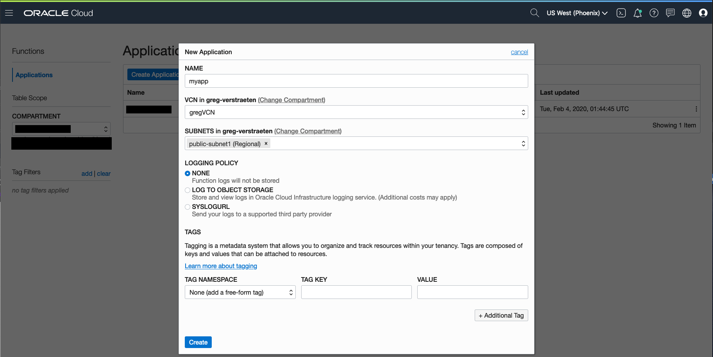

# Function Hello World

This function returns the "Hello World" message or "Hello <name>" when you provide a name in the function call payload.

As you make your way through this tutorial, look out for this icon .
Whenever you see it, it's time for you to perform an action.


## Pre-requisites
1. Start by making sure all of your policies are correct from this [guide](https://docs.cloud.oracle.com/iaas/Content/Functions/Tasks/functionscreatingpolicies.htm?tocpath=Services%7CFunctions%7CPreparing%20for%20Oracle%20Functions%7CConfiguring%20Your%20Tenancy%20for%20Function%20Development%7C_____4)

2. Have [Fn CLI setup with Oracle Functions](https://docs.cloud.oracle.com/iaas/Content/Functions/Tasks/functionsconfiguringclient.htm?tocpath=Services%7CFunctions%7CPreparing%20for%20Oracle%20Functions%7CConfiguring%20Your%20Client%20Environment%20for%20Function%20Development%7C_____0)


## Create an Application to run your function
You can use an application already created or create a new one using either the CLI or the OCI console.


### using the CLI
```
fn create app <app-name> --annotation oracle.com/oci/subnetIds='["<subnet-ocid>"]'
```
Get the OCID of the subnet in your VCN you wish to use.

e.g.
```
fn create app myapp --annotation oracle.com/oci/subnetIds='["ocid1.subnet.oc1.phx.aaaaaaaacnh..."]'
```

### using the OCI console
Log in to the [OCI console](https://console.us-phoenix-1.oraclecloud.com/) with your account, select the same region and compartment you specified when you configured the Fn CLI context.

On the OCI console, navigate to Developer Services > Functions. Click `Create Application` and specify:
- The name for the new application as *myapp*.
- The VCN and subnet in which to run the function.

Click `Create`.




## Writing the code of function

The [Python folder](./python) contains the files to deploy the `hello-python` function in Python:
* the code of the function, [func.py](./python/func.py)
* its dependencies, [requirements.txt](./python/requirements.txt)
* the function metadata, [func.yaml](./python/func.yaml)

The [Java folder](./java) contains the files to deploy the `hello-java` function in Java:
* the code of the function, [src/main/java/com/example/fn/HelloFunction.java](./java/src/main/java/com/example/fn/HelloFunction.java)
* its dependencies, [pom.xml](./java/pom.xml)
* the function metadata, [func.yaml](./java/func.yaml)

Note: In this example we will use the provided files. However, you can also generate boilerplat HelloWorld function 
files by running the following command from your terminal:
      
```
fn init --runtime <runtime-language> <func-name>
```

where <runtime-language> is one of the supported runtime languages (currently java, python, node, go and ruby are 
supported).


## Deploy the function


Change directory to *python* and deploy the `hello-python` function. Then change directory to *java* and deploy the
 `hello-java` function. See steps below.

To deploy the function, run the following command:
```
fn -v deploy --app <app-name>
```
e.g.
```
fn -v deploy --app myapp
```


## Invoke the function


The command to invoke a function is 
```
fn invoke <app-name> <func-name>
```

To invoke the Python `hello-python` function, run:
```
fn invoke myapp hello-python
```
The Python version displays `{"message":"Hello World"}`

To invoke the Python function with a payload, run: 
```
echo -n '{"name":"Bob"}' | fn invoke myapp hello-python
```
The `{"message":"Hello Bob"}` output is displayed.

To invoke the Java `hello-java` function, run:
```
fn invoke myapp hello-java
```
The Java version displays `Hello, world!`

To invoke the Java function with a payload, run: 
```
echo -n "Bob" | fn invoke myapp hello-java
```
The `Hello, Bob!` output is displayed.

Congratulations! You've just created, deployed, and invoked the HelloWorld function using Oracle Functions!