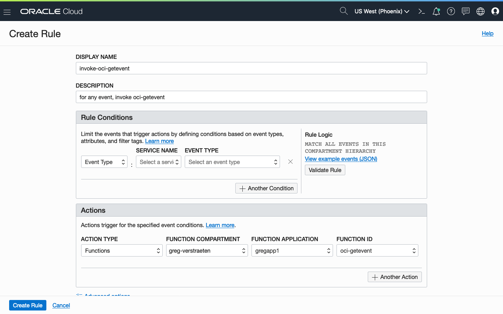

# Function that logs the details of a Cloud event

This function logs the details of a Cloud event.

As you make your way through this tutorial, look out for this icon .
Whenever you see it, it's time for you to perform an action.

## Pre-requisites
1. Start by making sure all of your policies are correct from this [guide](https://docs.cloud.oracle.com/iaas/Content/Functions/Tasks/functionscreatingpolicies.htm?tocpath=Services%7CFunctions%7CPreparing%20for%20Oracle%20Functions%7CConfiguring%20Your%20Tenancy%20for%20Function%20Development%7C_____4)

2. Have [Fn CLI setup with Oracle Functions](https://docs.cloud.oracle.com/iaas/Content/Functions/Tasks/functionsconfiguringclient.htm?tocpath=Services%7CFunctions%7CPreparing%20for%20Oracle%20Functions%7CConfiguring%20Your%20Client%20Environment%20for%20Function%20Development%7C_____0)

## Create an Application to run your function
You can use an application already created or create a new one as follow:

```
fn create app <app-name> --annotation oracle.com/oci/subnetIds='["<subnet-ocid>"]'
```
Get the OCID of the subnet in your VCN you wish to use.

e.g.
```
fn create app myapp --annotation oracle.com/oci/subnetIds='["ocid1.subnet.oc1.phx.aaaaaaaacnh..."]'
```

Running this function without access to the logs will have a limited value, we recommend configuring the application logs to go to Papertrail. Refer to [syslog-setup](https://orahub.oraclecorp.com/oracle-functions-samples/syslog-setup).

## Review and customize your function
Review the following files in the current folder:
* the code of the function, [func.py](./func.py)
* its dependencies, [requirements.txt](./requirements.txt)
* the function metadata, [func.yaml](./func.yaml)

## Deploy the function

```
fn -v deploy --app <your app name>
```
e.g.
```
fn -v deploy --app myapp
```

## Create the Cloud Event rule
Create a Cloud Event rule on the console navigating to Application Integration > Event Service. Click *Create Rule*.


Assign a display name and a description, customize the Rule Conditions or leave them empty to match all events. In the *Actions* section, set the *Action type* as "Functions", select your *Function Compartment*, your *Function Application*, and your *Function ID*.



## Test
Go to the logs, you should see events from your compartment. If you don't create something such as an Object Storage bucket to generate an event.
For example:
```json
event type: com.oraclecloud.objectstorage.createbucket
compartment name: greg-verstraeten
Full Cloud event json data:
{
    "eventType": "com.oraclecloud.objectstorage.createbucket",
    "cloudEventsVersion": "0.1",
    "eventTypeVersion": "2.0",
    "source": "ObjectStorage",
    "eventTime": "2019-12-12T22:25:08.502Z",
    "contentType": "application/json",
    "data": {
        "compartmentId": "ocid1.compartment.oc1..aaaaaaaal66tw5k262fsjsrgdqan5cbbfxvoydbhxx5hijth2h3qlbwmtdlq",
        "compartmentName": "greg-verstraeten",
        "resourceName": "bucket-20191212-1425",
        "resourceId": "/n/oracle-serverless-devrel/b/",
        "availabilityDomain": "PHX-AD-2",
        "additionalDetails": {
            "bucketName": "bucket-20191212-1425",
            "publicAccessType": "NoPublicAccess",
            "namespace": "oracle-serverless-devrel",
            "eTag": "47b12898-1925-449a-a761-7d1db57f0695"
        }
    },
    "eventID": "fca0653f-85c5-9466-8812-001c51d338a4",
    "extensions": {
        "compartmentId": "ocid1.compartment.oc1..aaaaaaaal66tw5k262fsjsrgdqan5cbbfxvoydbhxx5hijth2h3qlbwmtdlq"
    }
}
```